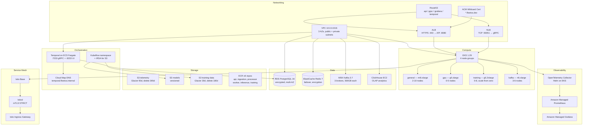
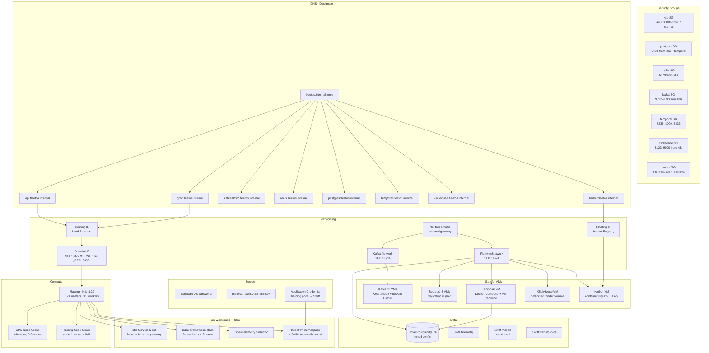

# FleetOS

A distributed robot fleet management platform that connects simulated humanoid robots to the cloud via gRPC/Kafka, exposes developer-facing REST/WebSocket APIs with auth and billing, serves AI inference through SB3 PPO policies, and provides full-stack analytics via Spark + ClickHouse.

## Repository Structure

```
robot-fleet/
├── platform/               # Cloud brain (Go backend, infra, SDKs)
│   ├── cmd/                # Service entry points (api, ingestion, processor, worker)
│   ├── internal/           # Core Go packages (api, service, store, auth, billing, temporal)
│   ├── admin-web/          # React admin console (tenant & API key management)
│   ├── deploy/             # Docker, Helm, Terraform configs
│   ├── analytics/          # Spark + ClickHouse analytics pipeline
│   ├── migrations/         # PostgreSQL DDL migrations (001-008)
│   ├── observability/      # Prometheus, Grafana, alerting
│   ├── sdk/                # Python + TypeScript SDKs
│   ├── training/           # SB3 PPO locomotion training pipeline
│   └── docker-compose.yml  # Full platform stack (17 services)
└── playground/             # Robot simulator (MuJoCo + React 3D)
    ├── simulator/          # MuJoCo Humanoid-v4 physics + gRPC telemetry
    ├── inference/          # SB3 PPO inference server (Python)
    ├── web/                # React + Three.js 3D dashboard
    ├── proto/              # Protobuf definitions (simulator copy)
    └── docker-compose.yml  # Playground stack (3 services)
```

## Features

- **Real-time Telemetry Pipeline** — Humanoid robots stream 20-DOF joint states, LiDAR, video, and audio over gRPC into Kafka, processed into Redis (hot state) + S3 (raw storage)
- **Developer API Platform** — REST, WebSocket, and gRPC APIs with OpenAPI 3.1 spec, TypeScript + Python SDKs
- **Admin Console** — React SPA at `/admin/` for tenant management, API key lifecycle (create/revoke), and billing overview
- **Multi-tenant Auth & Billing** — JWT + OAuth2/OIDC + DB-backed API key auth, RBAC (4 roles), per-tenant rate limiting, usage metering, Temporal-based billing workflows with dunning
- **AI Inference** — SB3 PPO policy serving with hot model swap, per-robot model assignment, performance metrics feedback loop
- **ML Training Pipeline** — Temporal orchestrates the full lifecycle: collect experience → submit Kubeflow training (GPU + Katib HPO) → evaluate → register → canary deploy. Custom `FleetOS-Humanoid-v1` Gymnasium env matches production physics
- **Experience Collection** — Simulator records (obs, action, reward, done) transitions at 10 Hz → S3 NDJSON batches for offline RL. 376-dim Humanoid-v4 observations for policy compatibility
- **Kubeflow Integration** — Dedicated GPU node group (g5.2xlarge, scale-from-zero), Katib for Bayesian HPO (20 trials, 3 parallel), PyTorchJob for distributed training, IRSA for S3 access
- **Canary Model Deployment** — Progressive rollout (5% → 25% → 50% → 100%) via Temporal workflows with deterministic robot selection, live success_rate comparison, and automatic rollback
- **Performance Metrics** — Reward computation (forward velocity + alive bonus - control cost), uptime tracking, fall detection — fed back to model registry for canary evaluation
- **Durable Command Pipeline** — Commands flow through Kafka into Temporal workflows with full audit trail, ack tracking via Kafka topics, and automatic retries
- **Semantic Commands** — Natural language robot control via extensible command registry (strategy pattern)
- **Model Registry** — Model lifecycle (staged → canary → deployed → archived) with S3 artifacts and per-robot model assignment
- **Analytics Pipeline** — S3 (raw NDJSON) → Spark (batch) → ClickHouse (OLAP) → Redis (cache) → API
- **ROS 2 Integration** — Bridge node publishing to standard ROS 2 topics (JointState, PoseStamped, BatteryState, LaserScan)
- **Cloud-native Infrastructure** — Kubernetes, Helm, Terraform (AWS), Docker Compose, Istio service mesh (mTLS)
- **Full Observability** — Prometheus metrics, Grafana dashboards, alerting rules, OpenTelemetry tracing

## Architecture

```
┌─ Playground (Robot) ─────────────────────────────┐
│  MuJoCo Humanoid-v4 Physics Simulation           │
│    ├─ gRPC StreamTelemetry → ingestion:50051     │  (joints, pose, metrics)
│    ├─ gRPC StreamCommands ← ingestion:50051      │  (walk, wave, inference)
│    └─ HTTP :8085 /spawn, /robots                 │
│  Web UI :5173 (Three.js 3D + command feed)       │
└──────────────────────────────────────────────────┘
        │ gRPC                    │ HTTP (proxied)
┌───────┴─────────────────────────┴────────────────┐
│  Platform (Cloud Brain)                          │
│  Ingestion :50051                                │
│    ├─ Telemetry → Kafka robot.telemetry          │
│    └─ Commands ← Kafka robot.commands.dispatch   │
│  API :8080                                       │
│    ├─ REST + WebSocket + Auth + Billing           │
│    ├─ Admin Console at /admin/ (React SPA)       │
│    └─ RBAC: admin, operator, developer, viewer   │
│  Inference :8081 (SB3 PPO policy)                │
│    ├─ Per-robot model lookup                     │
│    └─ Hot model swap from S3 registry            │
│  Worker (Temporal — 5 task queues)                │
│    ├─ CommandDispatchWorkflow                    │
│    ├─ ModelDeploymentWorkflow (canary rollout)   │
│    ├─ TrainingPipelineWorkflow → Kubeflow        │
│    ├─ BillingCycleWorkflow (monthly invoicing)   │
│    └─ WebhookFanoutWorkflow                      │
│  Processor → Postgres/Redis/S3/ClickHouse        │
│    └─ Performance metrics → model registry       │
│  Kubeflow (ML compute — separate namespace)      │
│    ├─ PyTorchJob on GPU nodes (g5.2xlarge)       │
│    ├─ Katib HPO (Bayesian, 20 trials)            │
│    └─ S3 artifacts (models + experience)         │
└──────────────────────────────────────────────────┘
```

## Quick Start

### Prerequisites

- Docker & Docker Compose
- Go 1.26+ (for local development)
- Node.js 20+ (for admin console development)

### Run Everything

```bash
# Start platform (17 services) + playground (3 services)
cd platform && docker compose up -d
cd playground && docker compose up -d

# Verify
curl http://localhost:8080/healthz
```

### Access Points

| Service | URL |
|---------|-----|
| Platform API | http://localhost:8080 |
| Admin Console | http://localhost:8080/admin/ |
| Playground 3D | http://localhost:5173 |
| Temporal UI | http://localhost:8233 |
| Grafana | http://localhost:3000 |
| Prometheus | http://localhost:9090 |

### Try It

```bash
# List robots
curl -H "X-API-Key: dev-key-001" http://localhost:8080/api/v1/robots

# Send a walk command
curl -X POST -H "X-API-Key: dev-key-001" -H "Content-Type: application/json" \
  http://localhost:8080/api/v1/robots/robot-0001/command \
  -d '{"type":"walk","params":{}}'

# Run AI inference
curl -X POST -H "X-API-Key: dev-key-001" -H "Content-Type: application/json" \
  http://localhost:8080/api/v1/inference \
  -d '{"instruction":"wave hello","robot_id":"robot-0001"}'

# Create a tenant (admin)
curl -X POST -H "X-API-Key: dev-key-001" -H "Content-Type: application/json" \
  http://localhost:8080/api/v1/admin/tenants \
  -d '{"name":"My Company","tier":"pro","billing_email":"dev@co.com"}'
```

## API Endpoints

| Method | Path | Description |
|--------|------|-------------|
| `GET` | `/healthz` | Health check |
| `GET` | `/api/v1/robots` | List robots (paginated) |
| `GET` | `/api/v1/robots/{id}` | Get robot (hot state + model assignment) |
| `POST` | `/api/v1/robots/{id}/command` | Send command → Kafka → Temporal |
| `GET` | `/api/v1/robots/{id}/commands` | Command history with audit trail |
| `POST` | `/api/v1/inference` | AI inference (uses robot's assigned model) |
| `GET` | `/api/v1/fleet/metrics` | Aggregated fleet stats |
| `POST` | `/api/v1/models` | Register model (staged) |
| `POST` | `/api/v1/models/{id}/deploy` | Deploy model (canary rollout) |
| `GET` | `/api/v1/billing/invoices` | Billing invoices |
| `PUT` | `/api/v1/billing/subscription/tier` | Change pricing tier |
| `POST` | `/api/v1/admin/tenants` | Create tenant + API key (admin) |
| `POST` | `/api/v1/admin/tenants/{id}/keys` | Generate API key (admin) |
| `GET` | `/api/v1/ws/telemetry` | WebSocket real-time stream |

### Authentication

- **API Key**: `X-API-Key` header (DB-backed with SHA-256 hashing)
- **JWT Bearer**: `Authorization: Bearer <token>` (HS256)
- **OAuth2/OIDC**: Bearer token validated against issuer's JWKS

Dev keys: `dev-key-001` (admin/enterprise), `dev-key-002` (viewer/free)

## Data Flow

### Command Pipeline (Kafka, no Redis pub/sub)
```
API → Kafka robot.commands → Processor → Temporal CommandDispatchWorkflow
  → Kafka robot.commands.dispatch (keyed by robot_id)
  → Ingestion CommandDispatcher → gRPC stream to robot
  → Robot executes → Kafka robot.command-acks
  → Worker AckBridge → signals Temporal workflow → audit finalized
```

### Model Deployment (Canary)
```
Register model (staged) → Deploy → Temporal ModelDeploymentWorkflow
  → StartCanary (validate, find baseline)
  → ExpandRollout 5% (fnv32(robot_id) % 100 < 5 → assign model)
  → 5 min observe → CompareCanaryMetrics (success_rate from robot uptime)
  → ExpandRollout 25% → observe → 50% → observe
  → FinalizeDeployment (100% of fleet, archive baseline)
  OR → RollbackModel (reassign affected robots to baseline)
```

### Billing Cycle
```
Tenant created → Temporal BillingCycleWorkflow (monthly, continue-as-new)
  → Every 6h: AggregateUsage (Redis counters → Postgres usage_daily)
  → Month end: GenerateInvoice → FinalizeInvoice → ProcessPayment
  → Payment failed: dunning loop (3 retries, 3-day intervals)
  → Signals: change-tier, cancel-subscription, retry-payment
```

### ML Training Pipeline (Temporal + Kubeflow)
```
Temporal TrainingPipelineWorkflow
  ├─ CollectExperienceStats — check S3 for robot experience data
  ├─ SubmitKubeflowRun — PyTorchJob (or Katib HPO) on GPU nodes
  │     Training uses FleetOS-Humanoid-v1 env (custom lab_room.xml)
  │     Optional: --base-model (fine-tune) + --from-experience (S3 data)
  ├─ EvaluateTrainedModel — compare vs baseline (gate: ≥95% of baseline)
  ├─ RegisterTrainedModel — model registry (staged)
  └─ Auto-deploy → child ModelDeploymentWorkflow (canary rollout)

Triggers: manual API, cron schedule, or success_rate drop below threshold
```

### RL Feedback Loop (Closed)
```
Robot runs in production/simulation
  → Simulator computes reward per step (forward_vel + alive - ctrl_cost)
  → Experience writer: (obs, action, reward, done) → S3 NDJSON batches
  → Processor aggregates uptime → model registry success_rate
                                                    ↓
  success_rate drops? → Temporal triggers TrainingPipelineWorkflow
  → Kubeflow trains on FleetOS-Humanoid-v1 + experience from S3
  → New policy uploaded to S3 → registered as staged
  → Canary deploy: 5% → 25% → 50% → 100% (with auto-rollback)
  → Robots get new inference_model_id → inference uses it
  → Performance metrics flow back → loop continues
```

## Testing

```bash
cd platform
go test -race ./internal/... ./test/...
```

## Tech Stack

| Layer | Technologies |
|-------|-------------|
| Backend | Go 1.26, gRPC, Protocol Buffers, net/http |
| Frontend | React 19, TypeScript, Three.js, Vite |
| Orchestration | Temporal (commands, deployments, training pipeline, billing, webhooks) |
| ML Training | Kubeflow (PyTorchJob, Katib HPO), SB3 PPO, custom Gymnasium env |
| ML Compute | GPU nodes (g5.2xlarge), scale-from-zero, IRSA for S3 |
| AI/ML | Python, SB3 PPO, MuJoCo Humanoid-v4, experience replay |
| Messaging | Kafka (telemetry, commands, acks, deployment events) |
| Storage | PostgreSQL 16, Redis 7, MinIO (S3), ClickHouse |
| Analytics | Apache Spark, ClickHouse (OLAP) |
| API | REST, WebSocket, OpenAPI 3.1, OAuth2/OIDC, JWT |
| SDKs | TypeScript, Python |
| Robotics | MuJoCo physics, ROS 2 (Humble) |
| Infrastructure | Kubernetes, Docker, Helm, Terraform (AWS + OpenStack), Istio |
| Observability | Prometheus, Grafana, OpenTelemetry |

## Infrastructure (Terraform)

FleetOS supports deployment on both **AWS** and **OpenStack**. Terraform configs live in `platform/deploy/terraform/` (AWS) and `platform/deploy/terraform/openstack/` (OpenStack).

### AWS



### OpenStack



### Resource Comparison

| Component | AWS | OpenStack |
|-----------|-----|-----------|
| Kubernetes | EKS (managed) | Magnum |
| Database | RDS PostgreSQL 16 | Trove PostgreSQL 16 |
| Cache | ElastiCache Redis 7 | Compute VMs + userdata |
| Message Broker | MSK Kafka 3.7 | Compute VMs + KRaft + Cinder |
| Object Storage | S3 (encrypted, lifecycle) | Swift (versioned) |
| Container Registry | ECR (6 repos) | Harbor VM |
| Workflow Engine | Temporal on ECS Fargate | Temporal on Compute VM |
| Analytics OLAP | ClickHouse on EC2 | ClickHouse on Compute VM |
| Load Balancer | ALB + NLB | Octavia |
| DNS | Route53 | Designate |
| TLS Certificates | ACM | Manual / Barbican |
| Secrets | Secrets Manager | Barbican |
| Monitoring | Amazon Managed Prometheus + Grafana | kube-prometheus-stack (Helm) |
| Tracing | OTEL Collector → AMP | OTEL Collector (Helm) |
| Service Mesh | Istio (Helm) | Istio (Helm) |

## License

MIT
